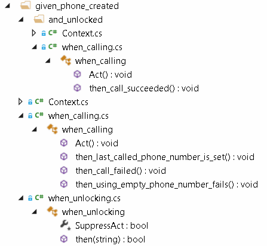
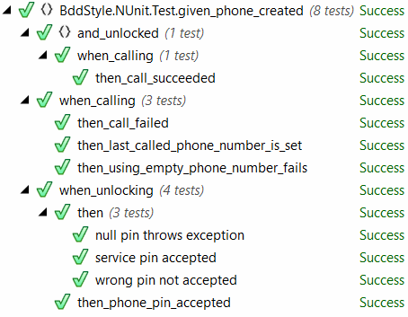
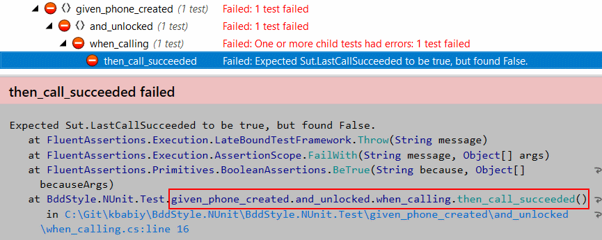

BddStyle.UnitTesting
=============
[](https://ci.appveyor.com/project/kbabiy/bddstyle-nunit)
[](https://www.nuget.org/packages/BddStyle.xUnit/)

Provides set of base classes to structure Unit Tests in the BDD shape (Given-When-Then, GWT)

This projects gives an approach to solving few common tasks to achieve high quality UT code:

- Maintainable
- DRY and reusable
- Allowing abstractions
	- e.g. reusing common setup
- Concise scope
- With descriptive naming
- Errors easy and fast localization
- Isolated: one assertion per test

Note: this project contains two packages, depending on your UT framework of preference:

- [BddStyle.NUnit](https://www.nuget.org/packages/BddStyle.NUnit/) - used as an example below
- [BddStyle.xUnit](https://www.nuget.org/packages/BddStyle.xUnit/)
	
Few links:

- [BDD in Wikipedia](https://en.wikipedia.org/wiki/Behavior-driven_development)
- [GWT explained on MartinFowler's blog](http://martinfowler.com/bliki/GivenWhenThen.html)

## Installing

- Install Nuget package to your unit test project

```
Install-Package BddStyle.NUnit
```

- (optional) For your convenience import [Resharper templates](BddStyle.NUnit/snippets/BddStyle.NUnit.ResharperTemplates) to generate tests faster
	- ReSharper => Tools => Templates Explorer => Import button

## Concepts and conventions

- Tests are structured like: **Given —< When —< Then**
	- Note that it is one-to-many ( —< ) relationship between the components
- It can be read as: Given [initial context], When [event occurs], Then [ensure some outcomes] 
	- **Given** section describes the state of the world before you begin the test case in this scenario. 
	Can be thought of as the pre-conditions to the test
		- is represented by a folder in the solution structure
		- usually (optionally) contains Context class, which is a place to write the test setup
		- examples: given\_tested\_class; given\_particular\_environment\_state

	- **When** section is the case that you are specifying
		- is represented by a class located in the Given specified folder
		- usually this class is inherited from the Context class (optionally, otherwise inherited from ContextBase class - see below for details) 
		therefore inheriting setup of the parent Given
		- example: when\_sut\_method1\_is\_called.cs

	- **Then** section describes the changes you expect due to the specified behavior
		- is represented by a method in the When class marked with NUnit.Framework.*Test*Attribute
		- contains check of one expectation from the testcase execution results
		- examples: then\_expected\_result\_is\_returned(); then\_exception\_is\_thrown();

## Example

### Example test project structure

#### Solution structure

How example solution looks like:



#### Tests structure

How example tests logical structure looks like:



#### Error localization

Troubleshooting and error localization:



### Code

[Example source codes](BddStyle.NUnit.Test/given_phone_created)

## Classes, inheritance model

Example of the proposed inheritance model is: **ContextBase** -> given\_description.Context.cs -> *and\_specified\_given.Context* -> when\_class.cs

- ContextBase - an entity provided by this library being the root entity and providing methods to override
	- Members
		- Arrange - is called before each testcase execution to set up the preconditions. 
		Is usually overriden in the Context (being the contents of the Given setup)
		- Act - contains the testcase actions to perform. 
		Is usually overriden in the When class
		- Cleanup - is called after each testcase execution to cleanup the test consequences. 
		Is usually overriden in the Context when such a cleanup is needed
		- SuppressAct - is a virtual property to allow disabling automatic Act execution (presuming it is going to be manually called in the test body). 
		It is a solution to improve data-driven tests (aka TestCase in NUnit) implementation

- As it can see from the example, nested Given is supported within the approach by creating nested folder (and Context class) 
with the methods overriden to specify the setup

## Snippets

- **bdc**: create Context
- **bdu**: create When class
- **bdt**: create Then method (test in the When class)

## Additional useful packages and tooling to consider for improving your UT experience

- [Fluent Assertions](http://www.fluentassertions.com/) - lib for rich and declarative UT assertions
- [Moq](https://github.com/Moq/moq4/wiki/Quickstart) - convenient mocking framework
- [NCrunch](http://www.ncrunch.net/) - continuous testing solution for VisualStudio

## Credits

- **Konstantin Babiy** - main contributor and current  owner
- **Kirill Medvedev** - originally introduced the idea and started the project
